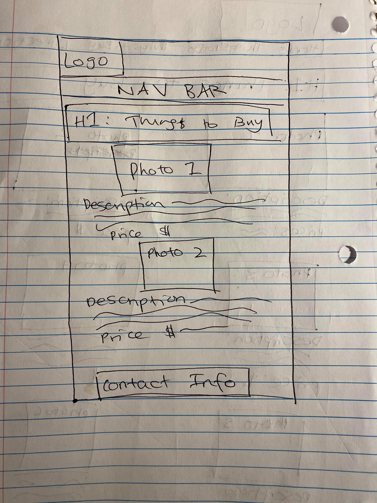

# Project 2: Design Journey

**For each milestone, complete only the sections that are labeled with that milestone.**

Be clear and concise in your writing. Bullets points are encouraged.

**Everything, including images, must be visible in Markdown Preview.** If it's not visible in Markdown Preview, then we won't grade it. We won't give you partial credit either. This is your warning.

## Design Planning

**Make the case for your decisions using concepts from class, as well as other design principles, theories, examples, and cases from outside of class.**

You can use bullet points and lists, or full paragraphs, or a combo, whichever is appropriate. The writing should be solid draft quality but doesn't have to be fancy.

### Audience (Milestone 1)
> Briefly explain who the intended audience(s) is for your website. Be specific and justify why this audience is appropriate for your site. Remember, you may not be the audience.

The first intended audience of my site will be Cornell University students who are health concious, ie. eat healthy foods frequently. This audience is appropriate for my site because health concious people would likely be interested in AppleFest since the festival sells healthy food options. Since it is a fruit festival, it also carries connotations to health and wellness, which would therefore entice healthy people to come to the festival. My second intended audience would be tourists and visitors who will be in the Ithaca area during the time of the festival. This audience is appropriate for my site because while visiting, tourists may be very interested in attending activities in Ithaca, and may want more information about the Ithaca Harvest festival before deciding it is worthwile to visit.

### Semi-Structured Interview Questions (Milestone 1)
> Plan your semi-structured interview which you'll use to identify the needs of your users. You are required to have a minimum of 4 questions.

1. Think back to last time you attended a festival or event. Walk me through how you gathered information out about the event.
2. Why did you decide to attend the event?
3. What is the importance of parking information to you for attending a festival or event?
4. Please explain any problems or obstacles you encountered while planning your visit to an event you've attended in the past. How did you overcomes these obstacles?
5. Explain how you spent your time at the event.
6. Finally, what do you know about the Ithaca Apple Festival?

### Interview Notes (Milestone 1)
> Interview at least 2 people from your audience. Take notes and include those notes here. Make sure to include a brief description of each interviewee.

**Interviewee 1:Student at Binghamton University who is visiting his girlfriend for the week. Interviewee has been to Ithaca quite a few times, but has never attended the Apple Festival before.**

*Notes:*
- Last festival was Ultra Music Festival in Singapore, mostly heard about information through word of mouth (friends), used Instagram page to look at photos
- Used the website to look for information on ticket prices and how to book tickets
- Also used website to see the lineup of artists
- Decided to attend because friends were going, lineup of artists was really good and it looked like there was a lot of fun attractions there
- Parking information not important because interviewee doesn't drive, took a taxi to the event
- Problems encountered include not being able to find the front entrance of the festival, ended up looking around for at least 30 minutes before finding the entrance
- Found entrance by using the map on the Ultra website (on mobile device), but the map wasn't very clear which is why it still took so long to find
- Wasn't told that water would be so expensive- that was annoying, wouldve liked to know the price of food and drink before attending. Ended up buying water anyway, just had to pay the price
- Interviewee was anticipating that their favorite band would be performing at eleven o'clock. They went to the stage at the time of the performance, but there ended up being a 45 minute delay. While waiting for the band, interviewee and friends checked the website to see if there was an announcement about a delay or cancellation but there was nothing on the website.
- Spent time: getting food, listening to the musical performances, talking to friends/socializing, resting
- Doesn't know anything about AppleFest, has never heard of it before.

**Interviewee 2: Cornell University students (Junior) who is vegan and only eats healthy food. Student has a car in Ithaca, and frequently uses it to attend local events and festivals. Student has been to AppleFest before**

*Notes:*
- Festival attended was the Ithaca Winter festival
- Heard information through friends and posters, decided to attend because it looked cool on the poster pictures. Wishes she could have had more information before attending because the festival turned out to be quite dissapointing because there wasn't actually much to do
- Parking information is important because interviewee has a car and always drives to local events
- Biggest problem encountered was inability to find parking information online, intervieee spent quite a bit of time trying to find a carpark in the area. Tried to look for a phone number to contact, and was unable to find one. Overcame this problem by asking a friend to get out of the car and ask one of the vendors for the best place to park
- Interviewee recalls another food event in her hometown (Chevy Chase, MD) where she got lost on the way to a festival because there was no directions on the website or posters
- Spent time: getting food and drinks, socializing, going to the shops in downtown
- Interviewee has heard a lot about AppleFest from friends, and knows that it sells a lot of delicious fruits and fun crafts
- Would like to attend, just hasn't had the time in the past

### Needs (Milestone 1)
> Analyze your audience's needs and wants from your notes above. List each need/want below. There is no specific number of needs required for this, but you need enough to do the job.

**Need/Want 1: Items Sold With Prices**
- From the interviews, I learned that my people spend the most time at festivals on purchasing good and drinks. Therefore, they may want to know about what items will be sold at the festival beforehand and the price of the items
- On the site, I will include lists the items sold at Apple Fest, including food, drinks and crafts, and specify the prices for each items.
- I will try to focus mostly on including the healthy food options, since my first target audience is people who are health concious
- I anticipate that it might be difficult to gather this information at the moment

**Need/Want 2: Detailed Parking Information**
- My interviews highlighted that people with a car want to know where to park and the cost of parking. They also need information on what to do if they need assistance with parking, or what to do if the parking spaces are all full
- On the website I need to include a map of where all the available parking spaces are as well as contact information for those who need assistance with parking

**Need/Want 3: Detailed Schedule of Performances with Times**
- Audience want to see a detailed list of the performances of the festival and the exact time that each performance will take place so they can plan when to attend the festival
- I will create a table schedule that specifies each artists and exactly what time they will be performing. I will also need to include the opening hours of the festival so users know which hours they can visit

**Need/Want 4: Announcements/Alerts**
- I learned from the interview that audiences want to be informed about any delays or alerts on the day that they attend the festival
- I will therefore add an alerts/announcements panel on the front page of the website, so that visitors can check the front page and see any urgent alerts on the day they attend the festival

**Need/Want 5: Detailed Map of the Festival**
- Audience need to see where each vendor/stall will be, so that on the day of the festival it is easier to navigate the space
- I will therefore include a detailed and colorcoded map on the website that shows audiences exactly where each stall and performance will be. The map should also include the location of toilets, parking, entrances and exists.
- From the interviews I also learned that audiences spend a lot of time socialising while eating at festivals, so including great eating spots could also be helpful
- I anticipate that it might be difficult to gather this information at the moment

**Need/Want 6: Contact Information**
- From the interviews, I learned that audiences need to know who to contact if they have questions about planning their visit or have questions while attending the festival
- On the website, I should include a phone number and email address that audiences can use to immediately contact festival organisers.

**Need/Want 7: Photographs**
- From the user interviews, I learend that audience like to see photographs of events/festival before attending to get a sense of what the festival vibe is like.
- On the website, I will include photos from previous years of the festival, most likely a few photographs on each page. I will try to find pictures that make the festival look the liviest, so audiences are enticed to attend the festival.

**Need/Want 8: What makes Apple Fest unique**
- From the user interviews, I learned that audiences want to read about what makes an event special/interesting before deciding whether to attend the event
- Therefore, I should include background information on the history of apple fest, the performance artists and what makes the products sold unique
- I could also include statistics on how many people have attended in the past to show audiences how popular the festival is

**Need/Want 10: Directions**
- From the interviews, I learned that audiences who drive may need driving directions so they don't get lost on the way to the festival.
- I will therefore include directions on the best route to get the the festival to avoid traffic

**Need/Want 11: Things to Do**
- From the interviews, I leanred that before deciding on whether to attend an event, audiences want to know what activities they can do at the festivals
- I will include detailed information on the games and activities that people can do at the festival, and what the most popular attractions are (besides food)
- Since my target audience includes tourists/vistors to Ithaca, I will also include some of the activities and retail in Downtown Ithaca, as they will be unfamiliar with the area.

### Initial Design (Milestone 1)
> Document your design process. Show us your card sorting. Describe your theme. Show us sketches of your site (mobile and desktop versions). etc. You should show us how your came up with your design and how your iterated on that design; show us the evolution of your design.

In this first card sort, I grouped my cards into 5 groups. The first one, which includes map of the festival, things to do, photographs and what makes apple fest unique. This page would probably be titled 'Things To Do', as the page gives users detailed information about the activities and attractions at the festival as well as why the festival is worth attending. The second group includes only items sold, so this page would probably be titled 'What to Buy'. I thought that this should go in its own catagory since from my user interviews, I learned that this is one of the most important pieces of information for audiences. The third group includes just 'announcements and alerts'. Since I want this to be on the index page so that users can imediately find urgent alerts when they are at the festival, this page will probably be the 'Home' page. However, upon further reflection I think there should be more information than just this on the home page, so I might do another card sort to figure out what else should be on this page. The fourth group includes parking information, directions and contact info. I thought these items would go well together since they are all concerned with how to get to the festival. Therefore, I called this group 'Directions and Parking'. The final group is the schedule of performances. Since I envisage that I will create a large table to organise this information, I think it would be best for it to be on its own page. However, upon further reflection, I realised that since I will title the first group 'Things to Do', the schedule of performances would actually belong in this group. Therefore, I decided to do another card sort, which is documented below.

In this second card sort, I moved the schedule of performances from its own group into the 'Things to Do' group. I think this organisation would be better for my audiences, as they would want to find all the information about attractions and activities on one page. The second change I made was moving 'What Makes Apple Fest' Unique and 'Photographs' to the Home page. This is because since I added the schedule of performances to the 'Things to Do' group, I realised that 'What Makes Apple Fest Unique' doesn't really belong under this header. Moving it to the home page also makes more sense for my audience anyway, since the first thing they will want to see is why the festival would be worth attending. I also looked back at my user interviews and realised that seeing photographs is very important for my audience, so moving this to the home page so that it's the first thing users see makes more sense too.

After deciding on the organisation of my site, I started to think about the theme. My first idea is to have a modern nature theme. This theme would convey ideas such as organic, farming, the environment, naturopathy, greenery and health, which would appeal to my target audience of health concious individuals. Since Ithaca is known for its beautiful gorges and greenery, many tourists who love nature may be visiting Ithaca to experience this. Therefore, my nature theme will also appeal to this audience. In line with this theme, I would use a mostly green colorscheme, perhaps with some red to convey good health. Since both my target audiences are college-aged student, I also think modern but fun and lively theme would appeal best to this age demographic. Overall, I want to give my audiences the impression that the festival is a fun, thriving, wholesome event with nutritious food and exciting attractions.

After I decided on my theme, I started to sketch the layout of my pages. Below is the sketch for my home page (desktop version).

I decided to place the navigation bar at the top of the page underneath the header logo so that my audience can easily locate the different pages. Since photographs are very important to my audience, I placed a hero image under the nav bar so that it is the first thing users see when they enter my site. Under the photo, I placed the alerts and announcements panel so users can easily find urgent announcements on the day of the festival. To get inspiration and compare my initial design to other sites, I browsed through a few other Apple Festival websites. I found that most websites included the opening hours on the front page, and I realised that this would make sense for my website too. Therefore, I sketched the home page once again and included the opening hours on the front page, as seen below:

While sketching this, I also thought about how users might have questions about the opening hours, and how the 'Directions and Parking' title doesn't make it clear that the contact info is in that page. Therefore, I decided to that I will place the contact information at the bottom of every page, so that if users have questions or concerns while browsing any of the pages, they can easily find the number and email of the festival.

Here is the sketch for the mobile version of the home page. I made the width of the nav bar higher than for the desktop version so that users can easily click on the links. I also laid out all the content vertically, so that users can read the text more easily.

Sketch of the desktop version of the 'Things to Do' page (version 1). Activities are laid out in rows of 2. Each item has a photo and a description of the item and the price below it. After sketching this initial draft, I realised that the pictures might be too small on the desktop version. Since I know that images are very important to my audiences, I decided to change the layout to make the images larger.

Sketch of desktop version of the 'Things to Do' page (version 2). In this second version,  each activity takes up the entire widtch of the page, and the photograph will probably take up about 25% of this width. At the bottom of the page, I will include the schedule of performances, which will be in a table format.

Sketch of the 'Things to Do' page (mobile version).In the mobile version, items are laid out one by one, so that it's easier to read each one.

Sketch of the 'Things to Buy' page (desktop version). I quite liked the 2 column layout that I intitially designed for the 'Things to Do' page, as I think my users will find it easy to navigate. Therefore, I decided to adapt this design for the Things to Buy page.

For the mobile version, I laid out each item one by one so users can easily see each photo and description.

Sketch of the 'Directions and Parking' page (desktop version 1). Since this page includes both directions and parking information, I will have another navigation bar below the main nav bar, where users can click on the links to be directed to the portion of the page they are looking for.

Sketch of 'Directions and Parking' page (mobile version).In the mobile version, the two sections are laid out one by one, so that it's easier to read each one. Just like the desktop version, users can click on the links at the top of the page to be directed to the section they wish to look at.

## Design

### Final Design (Milestone 2)
> Include the final sketches for each of your pages.

**Desktop Design:**
TODO

**Mobile Design:**
TODO

### Design Rationale (Milestone 2)
> Explain why your design is appropriate for your audience. Specially, why does your content organization, navigation, and site design/layout meet the needs of your users?

TODO

### Responsive Design Considerations (Milestone 2)
> Explain how you adapted your design to be responsive (support both mobile and desktop versions).

TODO

### Coded Draft Desktop Website (Milestone 2)
> Include screenshots of the draft version of your desktop design AND your mobile design. Include a screenshot for every page. If you're using Firefox, click the 3 dot button in the address bar and select "Take a Screenshot."

**Desktop Screenshots:**
TODO

**Mobile Screenshots:**
TODO

## User Testing (Round 1)

### User Testing Plan (Milestone 3)
> Plan out your user testing tasks before doing your user testing. These must be actual user testing tasks. **Tasks are not questions!**

1. TODO

2. TODO

3. TODO

### User 1 - Testing Notes (Milestone 3)
> When conducting user testing, you should take notes during the test. Place your notes here.

TODO

### User 1 (Milestone 3)
> Using your notes from above, describe your user by answering the questions below.

1. Who is your user, e.g., where does the user come from, what is the user's job, characteristics, etc.?

TODO

2. Does the user belong to your audience of the site? (Yes / No)
> If “No”, what’s your strategy of associating the user test results to your audience’s needs and wants? How can your re-design choices based on the user tests make a better fit for the audience?

TODO

### User 1 (Milestone 3)
> Report the results of your user's test. You should explain **what the user did**, describe the user's **reaction/feedback** to the design, **reflect on the user's performance**, determine what **re-design choices** you will make **for EACH task**. You can also add any additional comments. See the example design journey for an example of what this would look like.

Task: TODO: copy task here
- **Did you evaluate the desktop or mobile design?**
  - Pick one: desktop/mobile
- **How did the user do? Did they meet your expectation?**
  - TODO
- **User’s reaction / feedback to the design** (e.g., specific problems or issues found in the tasks)
  - TODO
- **Your reflections about the user’s performance to the task**
  - TODO
- **Re-design choices**
  - TODO
- **Additional Notes**
  - TODO: Justify your decisions; additional notes.

TODO...

### User 2 - Testing Notes (Milestone 3)
> When conducting user testing, you should take notes during the test. Place your notes here.

TODO

### User 2 (Milestone 3)
> Using your notes from above, describe your user by answering the questions below.

1. Who is your user, e.g., where does the user come from, what is the user's job, characteristics, etc.?

TODO

2. Does the user belong to your audience of the site? (Yes / No)
> If “No”, what’s your strategy of associating the user test results to your audience’s needs and wants? How can your re-design choices based on the user tests make a better fit for the audience?

TODO

### User 2 (Milestone 3)
> Report the results of your user's evaluation. You should explain **what the user did**, describe the user's **reaction/feedback** to the design, **reflect on the user's performance**, determine what **re-design choices** you will make **for EACH task**. You can also add any additional comments. See the example design journey for an example of what this would look like.

Task: TODO: copy task here
- **Did you evaluate the desktop or mobile design?**
  - Pick one: desktop/mobile
- **How did the user do? Did they meet your expectation?**
  - TODO
- **User’s reaction / feedback to the design** (e.g., specific problems or issues found in the tasks)
  - TODO
- **Your reflections about the user’s performance to the task**
  - TODO
- **Re-design choices**
  - TODO
- **Additional Notes**
  - TODO: Justify your decisions; additional notes.

TODO...

### Changes Based on User Testing (Milestone 3)
> What changes did you make to your design based on user testing?

TODO

## User Testing (Round 2)

### Finished Desktop & Mobile Website (Final Submission)
> Include screenshots of both the desktop and mobile version of your site that you will be using for user testing.

**Desktop Screenshots:**
TODO

**Mobile Screenshots:**
TODO

### User Testing Plan (Final Submission)
> Plan out your user testing tasks before doing your user testing. These must be actual user testing tasks. **Tasks are not questions!**
> These should be the same tasks from round 1.

1. TODO

2. TODO

3. TODO

### User 3 - Testing Notes (Final Submission)
> When conducting user testing, you should take notes during the test. Place your notes here.

TODO

### User 3 (Final Submission)
> Using your notes from above, describe your user by answering the questions below.

1. Who is your user, e.g., where does the user come from, what is the user's job, characteristics, etc.?

TODO

2. Does the user belong to your audience of the site? (Yes / No)
> If “No”, what’s your strategy of associating the user test results to your audience’s needs and wants? How can your re-design choices based on the user tests make a better fit for the audience?

TODO

### User 3 (Final Submission)
> Report the results of your user's test. You should explain **what the user did**, describe the user's **reaction/feedback** to the design, **reflect on the user's performance**, determine what **re-design choices** you will make **for EACH task**. You can also add any additional comments. See the example design journey for an example of what this would look like.

Task: TODO: copy task here
- **Did you evaluate the desktop or mobile design?**
  - Pick one: desktop/mobile
- **How did the user do? Did they meet your expectation?**
  - TODO
- **User’s reaction / feedback to the design** (e.g., specific problems or issues found in the tasks)
  - TODO
- **Your reflections about the user’s performance to the task**
  - TODO
- **Re-design choices**
  - TODO
- **Additional Notes**
  - TODO: Justify your decisions; additional notes.

TODO...

### User 4 - Testing Notes (Final Submission)
> When conducting user testing, you should take notes during the test. Place your notes here.

TODO

### User 4 (Final Submission)
> Using your notes from above, describe your user by answering the questions below.

1. Who is your user, e.g., where does the user come from, what is the user's job, characteristics, etc.?

TODO

2. Does the user belong to your audience of the site? (Yes / No)
> If “No”, what’s your strategy of associating the user test results to your audience’s needs and wants? How can your re-design choices based on the user tests make a better fit for the audience?

TODO

### User 4 (Final Submission)
> Report the results of your user's evaluation. You should explain **what the user did**, describe the user's **reaction/feedback** to the design, **reflect on the user's performance**, determine what **re-design choices** you will make **for EACH task**. You can also add any additional comments. See the example design journey for an example of what this would look like.

Task: TODO: copy task here
- **Did you evaluate the desktop or mobile design?**
  - Pick one: desktop/mobile
- **How did the user do? Did they meet your expectation?**
  - TODO
- **User’s reaction / feedback to the design** (e.g., specific problems or issues found in the tasks)
  - TODO
- **Your reflections about the user’s performance to the task**
  - TODO
- **Re-design choices**
  - TODO
- **Additional Notes**
  - TODO: Justify your decisions; additional notes.

TODO...

### Changes Based on User Testing (Final Submission
> What changes did you make to your design based on user testing?

TODO

## Self-Reflection (Final Submission)
> This was the first project in this class where you were able to follow a user-centered design process from start to finish. What did you learn from this experience?

TODO

> Take some time here to reflect on how much you've learned since you started this class. It's often easy to ignore our own progress. Take a moment and think about your accomplishments in this class. Hopefully you'll recognize that you've accomplished a lot and that you should be very proud of those accomplishments!

TODO
