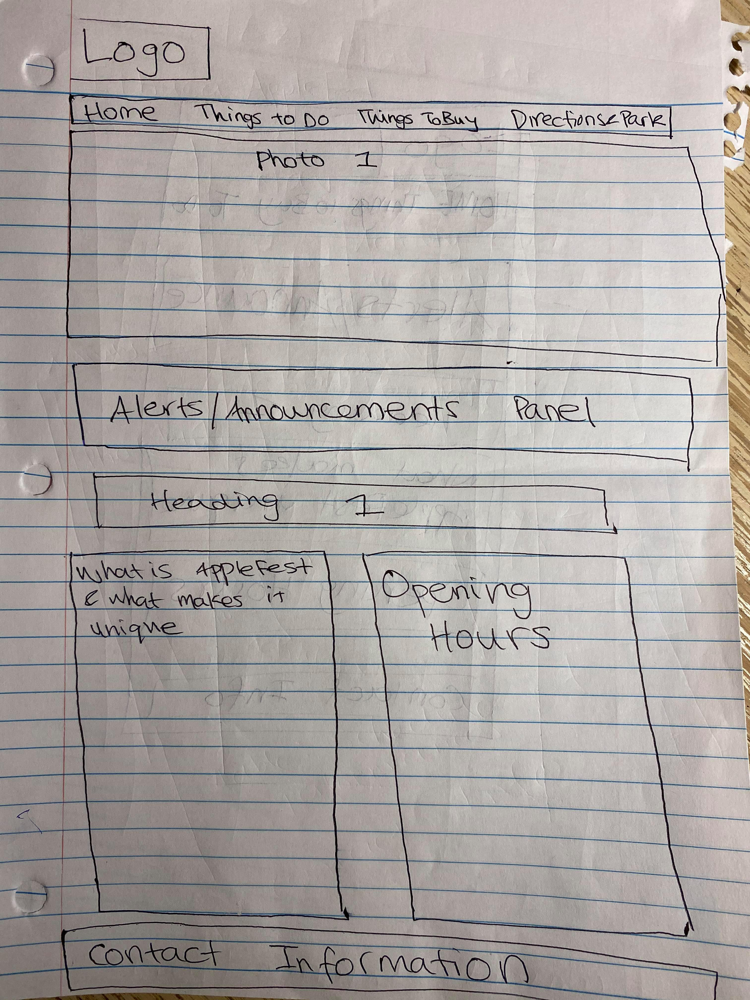
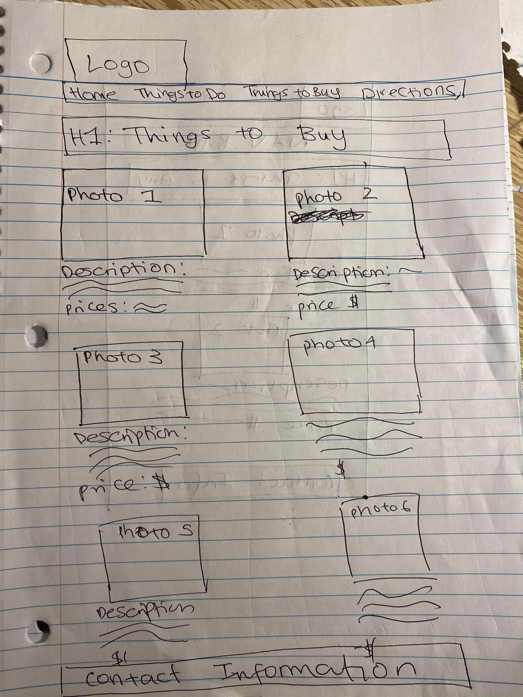
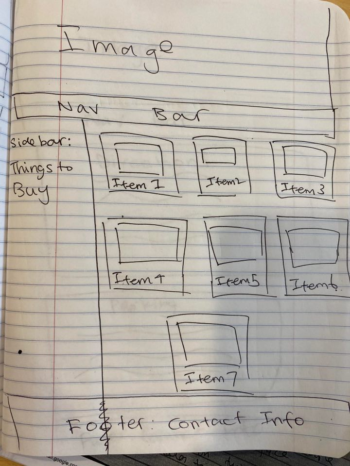

# Project 2: Design Journey

**For each milestone, complete only the sections that are labeled with that milestone.**

Be clear and concise in your writing. Bullets points are encouraged.

**Everything, including images, must be visible in Markdown Preview.** If it's not visible in Markdown Preview, then we won't grade it. We won't give you partial credit either. This is your warning.

## Design Planning

**Make the case for your decisions using concepts from class, as well as other design principles, theories, examples, and cases from outside of class.**

You can use bullet points and lists, or full paragraphs, or a combo, whichever is appropriate. The writing should be solid draft quality but doesn't have to be fancy.

### Audience (Milestone 1)
> Briefly explain who the intended audience(s) is for your website. Be specific and justify why this audience is appropriate for your site. Remember, you may not be the audience.

The first intended audience of my site will be Cornell University students who are health concious, ie. eat healthy foods frequently. This audience is appropriate for my site because health concious people would likely be interested in AppleFest since the festival sells healthy food options. Since it is a fruit festival, it also carries connotations to health and wellness, which would therefore entice healthy people to come to the festival. My second intended audience would be tourists and visitors who will be in the Ithaca area during the time of the festival. This audience is appropriate for my site because while visiting, tourists may be very interested in attending activities in Ithaca, and may want more information about the Ithaca Harvest festival before deciding it is worthwile to visit.

### Semi-Structured Interview Questions (Milestone 1)
> Plan your semi-structured interview which you'll use to identify the needs of your users. You are required to have a minimum of 4 questions.

1. Think back to last time you attended a festival or event. Walk me through how you gathered information out about the event.
2. Why did you decide to attend the event?
3. What is the importance of parking information to you for attending a festival or event?
4. Please explain any problems or obstacles you encountered while planning your visit to an event you've attended in the past. How did you overcomes these obstacles?
5. Explain how you spent your time at the event.
6. Finally, what do you know about the Ithaca Apple Festival?

### Interview Notes (Milestone 1)
> Interview at least 2 people from your audience. Take notes and include those notes here. Make sure to include a brief description of each interviewee.

**Interviewee 1:Student at Binghamton University who is visiting his girlfriend for the week. Interviewee has been to Ithaca quite a few times, but has never attended the Apple Festival before.**

*Notes:*
- Last festival was Ultra Music Festival in Singapore, mostly heard about information through word of mouth (friends), used Instagram page to look at photos
- Used the website to look for information on ticket prices and how to book tickets
- Also used website to see the lineup of artists
- Decided to attend because friends were going, lineup of artists was really good and it looked like there was a lot of fun attractions there
- Parking information not important because interviewee doesn't drive, took a taxi to the event
- Problems encountered include not being able to find the front entrance of the festival, ended up looking around for at least 30 minutes before finding the entrance
- Found entrance by using the map on the Ultra website (on mobile device), but the map wasn't very clear which is why it still took so long to find
- Wasn't told that water would be so expensive- that was annoying, wouldve liked to know the price of food and drink before attending. Ended up buying water anyway, just had to pay the price
- Interviewee was anticipating that their favorite band would be performing at eleven o'clock. They went to the stage at the time of the performance, but there ended up being a 45 minute delay. While waiting for the band, interviewee and friends checked the website to see if there was an announcement about a delay or cancellation but there was nothing on the website.
- Spent time: getting food, listening to the musical performances, talking to friends/socializing, resting
- Doesn't know anything about AppleFest, has never heard of it before.

**Interviewee 2: Cornell University students (Junior) who is vegan and only eats healthy food. Student has a car in Ithaca, and frequently uses it to attend local events and festivals. Student has been to AppleFest before**

*Notes:*
- Festival attended was the Ithaca Winter festival
- Heard information through friends and posters, decided to attend because it looked cool on the poster pictures. Wishes she could have had more information before attending because the festival turned out to be quite dissapointing because there wasn't actually much to do
- Parking information is important because interviewee has a car and always drives to local events
- Biggest problem encountered was inability to find parking information online, intervieee spent quite a bit of time trying to find a carpark in the area. Tried to look for a phone number to contact, and was unable to find one. Overcame this problem by asking a friend to get out of the car and ask one of the vendors for the best place to park
- Interviewee recalls another food event in her hometown (Chevy Chase, MD) where she got lost on the way to a festival because there was no directions on the website or posters
- Spent time: getting food and drinks, socializing, going to the shops in downtown
- Interviewee has heard a lot about AppleFest from friends, and knows that it sells a lot of delicious fruits and fun crafts
- Would like to attend, just hasn't had the time in the past

### Needs (Milestone 1)
> Analyze your audience's needs and wants from your notes above. List each need/want below. There is no specific number of needs required for this, but you need enough to do the job.

**Need/Want 1: Items Sold With Prices**
- From the interviews, I learned that my people spend the most time at festivals on purchasing good and drinks. Therefore, they may want to know about what items will be sold at the festival beforehand and the price of the items
- On the site, I will include lists the items sold at Apple Fest, including food, drinks and crafts, and specify the prices for each items.
- I will try to focus mostly on including the healthy food options, since my first target audience is people who are health concious
- I anticipate that it might be difficult to gather this information at the moment

**Need/Want 2: Detailed Parking Information**
- My interviews highlighted that people with a car want to know where to park and the cost of parking. They also need information on what to do if they need assistance with parking, or what to do if the parking spaces are all full
- On the website I need to include a map of where all the available parking spaces are as well as contact information for those who need assistance with parking

**Need/Want 3: Detailed Schedule of Performances with Times**
- Audience want to see a detailed list of the performances of the festival and the exact time that each performance will take place so they can plan when to attend the festival
- I will create a table schedule that specifies each artists and exactly what time they will be performing. I will also need to include the opening hours of the festival so users know which hours they can visit

**Need/Want 4: Announcements/Alerts**
- I learned from the interview that audiences want to be informed about any delays or alerts on the day that they attend the festival
- I will therefore add an alerts/announcements panel on the front page of the website, so that visitors can check the front page and see any urgent alerts on the day they attend the festival

**Need/Want 5: Detailed Map of the Festival**
- Audience need to see where each vendor/stall will be, so that on the day of the festival it is easier to navigate the space
- I will therefore include a detailed and colorcoded map on the website that shows audiences exactly where each stall and performance will be. The map should also include the location of toilets, parking, entrances and exists.
- From the interviews I also learned that audiences spend a lot of time socialising while eating at festivals, so including great eating spots could also be helpful
- I anticipate that it might be difficult to gather this information at the moment

**Need/Want 6: Contact Information**
- From the interviews, I learned that audiences need to know who to contact if they have questions about planning their visit or have questions while attending the festival
- On the website, I should include a phone number and email address that audiences can use to immediately contact festival organisers.

**Need/Want 7: Photographs**
- From the user interviews, I learend that audience like to see photographs of events/festival before attending to get a sense of what the festival vibe is like.
- On the website, I will include photos from previous years of the festival, most likely a few photographs on each page. I will try to find pictures that make the festival look the liviest, so audiences are enticed to attend the festival.

**Need/Want 8: What makes Apple Fest unique**
- From the user interviews, I learned that audiences want to read about what makes an event special/interesting before deciding whether to attend the event
- Therefore, I should include background information on the history of apple fest, the performance artists and what makes the products sold unique
- I could also include statistics on how many people have attended in the past to show audiences how popular the festival is

**Need/Want 10: Directions**
- From the interviews, I learned that audiences who drive may need driving directions so they don't get lost on the way to the festival.
- I will therefore include directions on the best route to get the the festival to avoid traffic

**Need/Want 11: Things to Do**
- From the interviews, I leanred that before deciding on whether to attend an event, audiences want to know what activities they can do at the festivals
- I will include detailed information on the games and activities that people can do at the festival, and what the most popular attractions are (besides food)
- Since my target audience includes tourists/vistors to Ithaca, I will also include some of the activities and retail in Downtown Ithaca, as they will be unfamiliar with the area.

### Initial Design (Milestone 1)
> Document your design process. Show us your card sorting. Describe your theme. Show us sketches of your site (mobile and desktop versions). etc. You should show us how your came up with your design and how your iterated on that design; show us the evolution of your design.

In this first card sort, I grouped my cards into 5 groups. The first one, which includes map of the festival, things to do, photographs and what makes apple fest unique. This page would probably be titled 'Things To Do', as the page gives users detailed information about the activities and attractions at the festival as well as why the festival is worth attending. The second group includes only items sold, so this page would probably be titled 'What to Buy'. I thought that this should go in its own catagory since from my user interviews, I learned that this is one of the most important pieces of information for audiences. The third group includes just 'announcements and alerts'. Since I want this to be on the index page so that users can imediately find urgent alerts when they are at the festival, this page will probably be the 'Home' page. However, upon further reflection I think there should be more information than just this on the home page, so I might do another card sort to figure out what else should be on this page. The fourth group includes parking information, directions and contact info. I thought these items would go well together since they are all concerned with how to get to the festival. Therefore, I called this group 'Directions and Parking'. The final group is the schedule of performances. Since I envisage that I will create a large table to organise this information, I think it would be best for it to be on its own page. However, upon further reflection, I realised that since I will title the first group 'Things to Do', the schedule of performances would actually belong in this group. Therefore, I decided to do another card sort, which is documented below.

In this second card sort, I moved the schedule of performances from its own group into the 'Things to Do' group. I think this organisation would be better for my audiences, as they would want to find all the information about attractions and activities on one page. The second change I made was moving 'What Makes Apple Fest' Unique and 'Photographs' to the Home page. This is because since I added the schedule of performances to the 'Things to Do' group, I realised that 'What Makes Apple Fest Unique' doesn't really belong under this header. Moving it to the home page also makes more sense for my audience anyway, since the first thing they will want to see is why the festival would be worth attending. I also looked back at my user interviews and realised that seeing photographs is very important for my audience, so moving this to the home page so that it's the first thing users see makes more sense too.

After deciding on the organisation of my site, I started to think about the theme. My first idea is to have a modern nature theme. This theme would convey ideas such as organic, farming, the environment, naturopathy, greenery and health, which would appeal to my target audience of health concious individuals. Since Ithaca is known for its beautiful gorges and greenery, many tourists who love nature may be visiting Ithaca to experience this. Therefore, my nature theme will also appeal to this audience. In line with this theme, I would use a mostly green colorscheme, perhaps with some red to convey good health. Since both my target audiences are college-aged student, I also think modern but fun and lively theme would appeal best to this age demographic. Overall, I want to give my audiences the impression that the festival is a fun, thriving, wholesome event with nutritious food and exciting attractions.

After I decided on my theme, I started to sketch the layout of my pages. Below is the sketch for my home page (desktop version).

I decided to place the navigation bar at the top of the page underneath the header logo so that my audience can easily locate the different pages. Since photographs are very important to my audience, I placed a hero image under the nav bar so that it is the first thing users see when they enter my site. Under the photo, I placed the alerts and announcements panel so users can easily find urgent announcements on the day of the festival. To get inspiration and compare my initial design to other sites, I browsed through a few other Apple Festival websites. I found that most websites included the opening hours on the front page, and I realised that this would make sense for my website too. Therefore, I sketched the home page once again and included the opening hours on the front page, as seen below:

While sketching this, I also thought about how users might have questions about the opening hours, and how the 'Directions and Parking' title doesn't make it clear that the contact info is in that page. Therefore, I decided to that I will place the contact information at the bottom of every page, so that if users have questions or concerns while browsing any of the pages, they can easily find the number and email of the festival.

Here is the sketch for the mobile version of the home page. I made the width of the nav bar higher than for the desktop version so that users can easily click on the links. I also laid out all the content vertically, so that users can read the text more easily.

Sketch of the desktop version of the 'Things to Do' page (version 1). Activities are laid out in rows of 2. Each item has a photo and a description of the item and the price below it. After sketching this initial draft, I realised that the pictures might be too small on the desktop version. Since I know that images are very important to my audiences, I decided to change the layout to make the images larger.

Sketch of desktop version of the 'Things to Do' page (version 2). In this second version,  each activity takes up the entire widtch of the page, and the photograph will probably take up about 25% of this width. At the bottom of the page, I will include the schedule of performances, which will be in a table format.

Sketch of the 'Things to Do' page (mobile version).In the mobile version, items are laid out one by one, so that it's easier to read each one.

Sketch of the 'Things to Buy' page (desktop version). I quite liked the 2 column layout that I intitially designed for the 'Things to Do' page, as I think my users will find it easy to navigate. Therefore, I decided to adapt this design for the Things to Buy page.

For the mobile version, I laid out each item one by one so users can easily see each photo and description.

Sketch of the 'Directions and Parking' page (desktop version 1). Since this page includes both directions and parking information, I will have another navigation bar below the main nav bar, where users can click on the links to be directed to the portion of the page they are looking for.

Sketch of 'Directions and Parking' page (mobile version). In the mobile version, the two sections are laid out one by one, so that it's easier to read each one. Just like the desktop version, users can click on the links at the top of the page to be directed to the section they wish to look at.

## Design

### Final Design (Milestone 2)
> Include the final sketches for each of your pages.

**Desktop Design:**

**Mobile Design:**

### Design Rationale (Milestone 2)
> Explain why your design is appropriate for your audience. Specially, why does your content organization, navigation, and site design/layout meet the needs of your users?
My final navigation is a navigation bar at the top of the page underneath the header image. I made the background color is a light green to convey ideas of nature and health, which will appeal to my audience of healthy individuals.   By placing the navigation bar at the top of the page underneath the heading image, it will be easy for my audience to quickly navigate between the different pages and find the information they need about the festival. The titles of the various pages tells my audiences exactly what is featured on that page- nothing more and nothing less.

My content organisation also meets the needs of both of my target audiences.
On each page, I have included a different large header image that shows the fun and exciting aspects of the festival. This will appeal greatly to my audience, especially those who are visitors of Ithaca, because I learned from my interviews that users want to images of the event itself in order to see whether the festival is worth attending. I also included the contact information at the bottom of every page, because my users, especially users who are visitors/tourists of Ithaca, may have several questions or concerns about the festival and may need to find the information quickly.

On the home page, I decided to include the opening hours of the festival as a sidebar, because I learned from my user interviews that it is very important for them to be able to find this information quickly-especially on the day of the festival itself. My home page also includes an alert/announcements panel, so that my users can find urgent information or messages as soon as they enter my page. I learned from my user interviews that this was extremely important in order to make their visit as smooth as possible. Finally, the home page also includes information about the Ithaca, which will be useful for my audience of tourists/visitors as they may not know much about the town.

On the 'Things to Do' page, I included large images and descriptions of a few of the activities offered at the festival. I also included a table of the performances, as my user interviews indicated that having a schedule will be useful in order for users to decide what time to attend the festival.

On the 'Things to Buy' page, I have included images and prices of some of the items sold at the festival. I have also indicated whether the items are vegan or vegetarian, which is appropriate for my audience of healthy eating students because they may have specific dietary requirements. I included the price because my user interviews indicated that knowing how much each item will cost is useful for users so they can know how much money to bring to the festival.

Finally, the last page includes both directions and parking information, which is appripriate for my target audience because many college students have a car in Ithaca, so info about the best way to get to the festival and where to park will be very useful for them. I also included other transportation options (the TCAT and the bus), because visitors/tourists who don't have a car may need to know other ways of getting to the festival.

For the site's design/layout, my overall goal was to make sure that healthy eating individuals felt at 'home', and tourists felt excited by the opportunity to visit the unique festival. By making the colorscheme green and red, I am appealing to the audience of health concious individuals as these colors convey ideas of health, nature, and greenery. On each page, I also included a different large header image, such that it is the first thing that users see when they visit each page. This would appeal greatly to tourists, as they can see how beautiful Ithaca is and how fun the Apple Festival would be. This would also be especially appealing since they may not have heard much about Apple Fest or Ithaca before. For the font, I used more fun and somewhat childish fonts because I want to convey the idea that the festival is really welcoming and enjoyable.

### Responsive Design Considerations (Milestone 2)
> Explain how you adapted your design to be responsive (support both mobile and desktop versions).

To ensure my site supports both mobile and desktop versions, I used media queries. For my queries, Since most mobile devices often have screen sizes that are less than 600px wide, I set the maximum width on my media queries to 600px. More specifically, for the pages with a sidebar, I used media queries to shift the sidebar to the bottom or top of the page when the user is on a mobile device in order to make better utilization of the horizontal space. On the 'thigns to do' page, I also ensured that on mobile versions, the image of each activity is positioned on top of the description of the activity, so the text is still easily readable on mobile versions. I also inverted the columns and rows of the table to ensure that mobile users don't have to use horizontal scroll while looking at the schedule of performances. On the 'things to buy' page, I also used media queries to make it such that each item is laid out vertically, and also moved the right side bar to the top of the page. Finally, on the 'directions and parking' page, I removed the margins of the two paragraphs to make better utilization of the horizontal space.

### Coded Draft Desktop Website (Milestone 2)
> Include screenshots of the draft version of your desktop design AND your mobile design. Include a screenshot for every page. If you're using Firefox, click the 3 dot button in the address bar and select "Take a Screenshot."

**Desktop Screenshots:**

**Mobile Screenshots:**

## User Testing (Round 1)

### User Testing Plan (Milestone 3)
> Plan out your user testing tasks before doing your user testing. These must be actual user testing tasks. **Tasks are not questions!**

1. You are at the Apple Festival and realise that you lost your bag. You want to find someone to contact so they can help you find your belongings.

2. You are at the Apple Festival and want to find out when your favorite band, 'Rock Around', is playing.

3. You are deciding whether to attend the Apple Festival and want to find out whether the festival sells food that meets your dietary requirements.

4. You are going to visiting Ithaca for the weekend and plan to arrive on September 24th at around 3pm. Identify whether you will be able to attend the festival.

### User 1 - Testing Notes (Milestone 3)
> When conducting user testing, you should take notes during the test. Place your notes here.

Task 1: Participant asks to click on 'Directions and Parking' and carefully reads each section. Asks to scroll down, and identifies the phone number, saying they would call that number.

Task 2: Participant clicks on the 'Things to Do' page. Participant asks to scrolls up and down a few times. Particpant clicks on the 'Home' page, stays on this page for a few seconds. Next user asks to hover over each link in the nav bar for a few seconds. Participant clicks on 'Things to Do' and reads each paragraph carefully. Participant scrolls down. Participant says 'Oh right here, I didn't see this. Saturday at 12pm.'

Task 4: Participant clicks on the Home page. Participant asks 'Which date again?' and I repeat the date. Participant replies 'No', because it is going to be closed that day.

Task 3: Participant clicks on the 'Things to Buy' page. Participant stays on this page for a while. Participant says 'Oh I'm gluten free so they wouldn't be selling anything I can eat.'

### User 1 (Milestone 3)
> Using your notes from above, describe your user by answering the questions below.

1. Who is your user, e.g., where does the user come from, what is the user's job, characteristics, etc.?

The user is a recent graduate of University of Southern California currently living in Los Angeles. The users sister attends Cornell University. Participant has visited Ithaca once before, and expresses an interest in visiting the town again soon. User has never heard of apple festival before. The user is also gluten free.

2. Does the user belong to your audience of the site? (Yes / No)
> If “No”, what’s your strategy of associating the user test results to your audience’s needs and wants? How can your re-design choices based on the user tests make a better fit for the audience?

Yes, because the user is an individual who will be visiting Ithaca

### User 1 (Milestone 3)
> Report the results of your user's test. You should explain **what the user did**, describe the user's **reaction/feedback** to the design, **reflect on the user's performance**, determine what **re-design choices** you will make **for EACH task**. You can also add any additional comments. See the example design journey for an example of what this would look like.

**Task 1: You are at the Apple Festival and realise that you lost your bag. You want to find someone to contact so they can help you find your belongings.**
- **Did you evaluate the desktop or mobile design?**
  - Desktop
- **How did the user do? Did they meet your expectation?**
  - The user performed this task well, and was able to locate the contact information very quickly which met my expectations.
- **User’s reaction / feedback to the design** (e.g., specific problems or issues found in the tasks)
   - The user did not encounter any problems with locating the contact information very quickly.
- **Your reflections about the user’s performance to the task**
  - The user first clicked on the 'Directions and Parking' page, indicating that they believed the contact information would be displayed on this page. This indicates that it was not obvious to the user that the contact information can be found in the footer of every page.
- **Re-design choices**
  - To make it more obvious that the contact information can be found at the bottom of every page, I will create a buttom at the top of the page that says 'Contat Information' so that users know exactly where to find the information quickly, especially in times of emergency.

**Task 2: You are at the Apple Festival and want to find out when your favorite band, 'Rock Around', is playing.**
- **Did you evaluate the desktop or mobile design?**
   - Desktop
- **How did the user do? Did they meet your expectation?**
  - The user did not perform this task very well, and got stuck on trying to locate the schedule of performances. This did not meet my expectations, as I thought that it was very obvious where the schedule could be found.
- **User’s reaction / feedback to the design** (e.g., specific problems or issues found in the tasks)
   - Although the user first went to the 'Things to Do' page, they were not able to find the schedule of performances easily. Since they did not see that the schedule was at the bottom of the page, they tried to find it in the other pages, and spent a long time looking carefully at each paragraph on the other pages to see if the information about the performances could be found there. When the user finally found the schedule of performances, the user themselves was surprised that they did not see it when they first looked at that page.
- **Your reflections about the user’s performance to the task**
   - Although I had believed that the table placed at the bottom of the page was very obvious, this user test indicates that either the table is not big enough for the user to see, or the heading that says 'Schedule of Performances' was not obvious enough for to locate. It could also possibly be that the user assumed that the schedule would be at the top of the page.
- **Re-design choices**
  - To make it easier for users to locate the schedule of performances, I will move the table to the top of the 'Things to Do' page as this is probably the most important piece of information for users when looking for 'Things to Do', especially if they are at the festival and want to quickly find out when their favorite band is playing. I will also make the heading a different color so it is more visible and obvious, and might also enlarge the table and the text inside the table so users can quickly locate the performer they are looking for.

**Task 3: You are deciding whether to attend the Apple Festival and want to find out whether the festival sells food that meets your dietary requirements.**
- **Did you evaluate the desktop or mobile design?**
  -Desktop
- **How did the user do? Did they meet your expectation?**
    - The user performed this task quite well, and met my expectations. However, I expected the user to read the sidebar description, but the user did not, they only looked at the figures and the figure captions.
- **User’s reaction / feedback to the design** (e.g., specific problems or issues found in the tasks)
    - The user immediately clicked on the 'Things to Do' page, and was able to quickly locate the food items and the dietary specifications.
    - However, since the user was gluten free, the user indicated that they would not have any food to eat if they were to attend the festival.
- **Your reflections about the user’s performance to the task**
  - Since the user immediately clicked on the 'Things to Do' page, it indicates that it was obvious to the user where the information about food items and the dietary specifications could be found.
  - However, the user did not read the sidebar description, which contains important information about what to do if the items do you fulfill your dietary needs
  - Since the user did not read this sidebar description, it  indicates that the user did not think that there would be relevent or important information here.
  - This user is gluten gree which I didn't think about as a dietary requirements before
- **Re-design choices**
   - To encourage users to read the sidebar description, especially the part that tells users to contact the festival organisers if they have any dietary concerns, I will either make this part of the text bold or italisized so that it stands out to the user and they can easily see it. I will also make 'contact us' a link to the bottom of the page, so users can immediately click on this and find the contact information if they need to.

**Task 4: You are going to be in Ithaca for the weekend and want to attend the Apple Festival on September 24th at around 3pm. Identify whether you will be able to attend the festival.**
- **Did you evaluate the desktop or mobile design?**
  -Desktop
- **How did the user do? Did they meet your expectation?**
  - My expectation for this task was for the user to first locate the dates of the festival, which are on the 'Things to Do page'. I then expected the user to check the 'Festival Hours' information displayed on the home page, and identify that they would in fact be able to attend the festival.
  -  However, the user did not check the 'Things to Do' page, and instead only looked at the festival hours. The user also assumed that since the announcement said that the Apple Cider Trail would be closed, this therefore meant that the festival wouldn't be running that day. Therefore, the user did not meet my expectation for this task.
- **User’s reaction / feedback to the design** (e.g., specific problems or issues found in the tasks)
   - While perfoming this task, the user  only looked at the home page, and saw that there was an announcement that the Apple Cider Trail would be closed on that date.
   - From this information, the user deduced that they would therefore not be able to attend the festival on that day.
- **Your reflections about the user’s performance to the task**
   - Since the user only looked at the home page while performing this task, it indicates that the user assumed that  information on the opening dates and time of the festival would only be found on this page.
   - The user also looked at the Announcements Panel for information on whether the festival would be open. Since the panel indicated that the Cider Trail would be closed on that date, the user also assumed that the entire festival would be closed. This makes sense, since the user does not know that the Cider Trail is only one activity offered at the Harvest festival.
- **Re-design choices**
  - The users performance of this task highlights 2 areas of my website that need to be redesigned.
  -  The first problem is with the announcements panel. More specifically, the first announcement that I put does not make it clear enough that only *one* attraction will be closed that day. Therefore, on the announcements panel, I will be sure to include information about how the other attractions at Apple Festival will still be open.
  -The second problem is to do with the opening dates of the festival. Presently, this information can only be found on the 'Things to Do' page, under each specific activity. However, my user interviews indicated that the user expects to find this information on the home page. Therefore, I will include the opening dates of the festival on the home page, more specifically on the sidebar which currently displays the opening hours of the festival.

### User 2 - Testing Notes (Milestone 3)
> When conducting user testing, you should take notes during the test. Place your notes here.

Task 1: User asks to scroll down on the home page to the very bottom of the page. User indicates they would call the phone number immediately.
Task 4: User asks to navigate to the home page. User stays at the top of the page for a while and asks to keep scrolling down slowly. User is slightly confused, but answers: 'Yes, I will be able to attend for a bit because its open everyday at 3pm'
Task 1: User asks to see the navigation bar, thinks for a second and asks to go to 'Things to Do'. User asks to scroll down slowly. User says 'Oh there, schedule of performances. So 12pm on Saturday right?'
Task 3: User asks to go to the 'Things to Do' page. User says 'Yeah because I'm vegan I do have some options to eat'.

### User 2 (Milestone 3)
> Using your notes from above, describe your user by answering the questions below.

1. Who is your user, e.g., where does the user come from, what is the user's job, characteristics, etc.?

This user is a Cornell University student in her Junior Year. Student is studying Biology and Society. User has been vegan for about 1 and a half years. The user has been to Apple Fest twice before.

2. Does the user belong to your audience of the site? (Yes / No)
> If “No”, what’s your strategy of associating the user test results to your audience’s needs and wants? How can your re-design choices based on the user tests make a better fit for the audience?

Yes, the user belongs to the audience because she is a Cornell student who eats healthy.

### User 2 (Milestone 3)
> Report the results of your user's evaluation. You should explain **what the user did**, describe the user's **reaction/feedback** to the design, **reflect on the user's performance**, determine what **re-design choices** you will make **for EACH task**. You can also add any additional comments. See the example design journey for an example of what this would look like.

**Task 1: You are at the Apple Festival and realise that you lost your bag. You want to find someone to contact so they can help you find your belongings.**

- **Did you evaluate the desktop or mobile design?**
  -Mobile
- **How did the user do? Did they meet your expectation?**
  - For this task, I first expected users to be able to quickly and efficiently find the contact information at the bottom of any of the pages. I also expected users to identify that they would go to the Theatre Office space to try to speak to someone directly. Since the user automatically scrolled down to the bottom of the home page, the user met my first expectation for this task.
- **User’s reaction / feedback to the design** (e.g., specific problems or issues found in the tasks)
  - The user immediately scrolled down to the bottom of the home page, and was able to quickly identify the phone number that they would call in case of an emergency.
- **Your reflections about the user’s performance to the task**
  - Since the user immediately went to the bottom of the page, it indicates that the user assumed that the contact information could be found here. However, the user indicated that they would call the phone number instead of just going to the office which is located very closeby to the festival. I was surprised by this, as I expected that if someone lost their belongings, they would go to the office to try to find a lost and found.
- **Re-design choices**
  - This user interview indicated that the phone number is the most important piece of contact information for users when they need to urgently speak to an organizer of the festival. Therefore, I will remove the office location from the contact information so as to make it even easier for users to quickly find this phone number.

**Task 2: You are at the Apple Festival and want to find out when your favorite band, 'Rock Around', is playing.**
  - **Did you evaluate the desktop or mobile design?**
    - Pick one: Mobile
  - **How did the user do? Did they meet your expectation?**
    - For this task, I expected users to navigate to the 'Things to Do' page and immediately find the schedule of performances at the bottom of the page. The user somewhat met my expectation for this, as they were able to find the table quite quickly.
  - **User’s reaction / feedback to the design** (e.g., specific problems or issues found in the tasks)
    - The user immediately navigated to the 'Things to Do' page, indicating that it was clear to the user where the schedule could be found. However, the user did encounter some problems with trying to locate the exact band inside of the table. At first, the user specified the wrong date and time. However after a few seconds, they were able to indentify the time and date correctly.
  - **Your reflections about the user’s performance to the task**
    - The users performance of the task indicates two things to me. The first is that on the mobile version, it is very obvious where the table can be found since it takes up the entire width of the screen on the 'Things to Do' page. The second thing however is that since the table is quite condensed, it can be difficult to read the table and find the correct row and column for the performer.
  - **Re-design choices**
    - In order to make it easier for users to read the table on the mobile version, I will change the mobile table such that each alternating row is a different color.
  - **Additional Notes**
    - I believe that this change only needs to be made with the mobile version, since in my first user test which used the desktop version, the user was able to very quickly find the correct date and time of the performer.

**Task 3: You are deciding whether to attend the Apple Festival and want to find out whether the festival sells food that meets your dietary requirements.**
  - **Did you evaluate the desktop or mobile design?**
     - Mobile
  - **How did the user do? Did they meet your expectation?**
    - For this task, I expected users to navigate to the 'Things to Buy page' and first read the description at the top of the page. I then expected users to look at each item on the page, and identify whether the items listed meet their dietary requirements. Therefore, the user somewhat met my expectations  for this task.
  - **User’s reaction / feedback to the design** (e.g., specific problems or issues found in the tasks)
    - While performing this task, the user did not encounter any difficulties or issues. To user was able to immediately identify where to find the information about her the food items sold at the festival, and identified that since she is vegan, there are a few food options for her to choose from at the festival.
  - **Your reflections about the user’s performance to the task**
    - I was mostly happy with the way that the user performed this task. However, as with the first user test, the user did not stop to read the information in the sidebar about what to do if none of the food items meet your dietary requirements. This was somewhat surprising to me, because on the mobile version this information is displayed at the top of the page.
  - **Re-design choices**
    - As I mentioned upon reflecting on the other user interview, to encourage users to read the sidebar description, especially the part that tells users to contact the festival organisers if they have any dietary concerns, I will either make this part of the text bold or italisized so that it stands out to the user and they can easily see it. I will also make 'contact us' a link to the bottom of the page, so users can immediately click on this and find the contact information if they need to.

**Task 4: You are going to be in Ithaca for the weekend and want to attend the Apple Festival on September 24th at around 3pm. Identify whether you will be able to attend the festival.**
  - **Did you evaluate the desktop or mobile design?**
    - Mobile
  - **How did the user do? Did they meet your expectation?**
     - My expectation for this task was for the user to first locate the dates of the festival, which are on the 'Things to Do page'. I then expected the user to check the 'Festival Hours' information displayed on the home page, and identify that they would in fact be able to attend the festival.
     - Therefore, the user did not meet my expectations for this task.
  - **User’s reaction / feedback to the design** (e.g., specific problems or issues found in the tasks)
     - When prompted with this task, the user first navigated to the home page. Here, the user encountered some difficulties, as she could not find the dates for which the festival was open. Instead of trying to find this information on another page, she instead simply said that she would be able to attend the festival based on the information about the festival hours found on the sidebar.
  - **Your reflections about the user’s performance to the task**
     - The user seemed very confused when browsing the home page. I believe this is because she expected to see the exact dates for the festival on the home page. I was still quite surprised that the user did not think to check any of the other pages for this information, and instead based her answer off of the sidebar information.
  - **Re-design choices**
     - Presently, the information about the festival dates can only be found on the 'Things to Do' page, under each specific activity. However, my user interviews indicated that the user expects to find this information on the home page. Therefore, I will include the opening dates of the festival on the home page, more specifically on the sidebar which currently displays the opening hours of the festival.

### Changes Based on User Testing (Milestone 3)
> What changes did you make to your design based on user testing?
   1. The first change I made to my design was adding a 'Contact Us' button the top of the home page. I decided to add this button because my first user interview indicated that it was not that obvious to users the the information can be found at the bottom of the page. Therefore, by adding this button, users can easily find the contact information as soon as they enter the site. This will be especially useful for when users are at the festival and are in an emergency, and need to contact someone immediately.
   2. The second change I made was moving the schedule of performances table from the bottom of the 'Things to Do' page to the top of the page. This is because in my first user test, the participant had trouble finding the table on that page. By moving it to the top of the page, users can easily find this information. I think having it at the top of the page is also important because this is probably the piece of information most useful to users, especially when they want to see what time their favorite band is performing on the day they are at the festival.
   3. The third change I made to the design of my site was making some pieces of information on the 'Things to Buy' sidebar in bold using the strong tag. I did this because I believe that the information is very important, and both of the partipants in the user tests did not read this information.
   4. The fourth change I made was to the mobile version of the schedule of performances table. More specifically, I made alternating rows of the table a light grey shade in order to make it easier for users to read the table and easily find  the pieces of information they need.
   5. The final change I made to the design of my site was to change the information on the sidebar of the home page. More specifically, instead of just including the opening hours, I changed it to include the exact dates and the opening hours of each date. I did this because both my user interviews indicated that user expected to find the dates on the home page.

## User Testing (Round 2)

### Finished Desktop & Mobile Website (Final Submission)
> Include screenshots of both the desktop and mobile version of your site that you will be using for user testing.

**Desktop Screenshots:**
TODO

**Mobile Screenshots:**
TODO

### User Testing Plan (Final Submission)
> Plan out your user testing tasks before doing your user testing. These must be actual user testing tasks. **Tasks are not questions!**
> These should be the same tasks from round 1.
1. You are at the Apple Festival and realise that you lost your bag. You want to find someone to contact so they can help you find your belongings.

2. You are at the Apple Festival and want to find out when your favorite band, 'Rock Around', is playing.

3. You are deciding whether to attend the Apple Festival and want to find out whether the festival sells food that meets your dietary requirements.

### User 3 - Testing Notes (Final Submission)
> When conducting user testing, you should take notes during the test. Place your notes here.

Task 3: The user spends a few seconds looking at the navigation bar. User then says 'Go go things to buy I guess?'.
User then takes a minute to read the sidebar. User says: 'I'm celiac, so I would call the AppleFest and ask if they have any food for me'. User then asks to scroll down. User asks to click on the Apple Cider Donuts. After the click doesn't navigate anywhere, user asks to keep scrolling. User then says 'Yeah I would call them.'

Task 2: User asks to go to 'Things to Do' page. User says: 'Saturday at 12pm.'

Task 1: User asks to go to the 'Directions and Parking' page. User asks to keep scrolling down. User then says 'Oh there. I would probably call or go to the office'.

### User 3 (Final Submission)
> Using your notes from above, describe your user by answering the questions below.

1. Who is your user, e.g., where does the user come from, what is the user's job, characteristics, etc.?

This user is a parent of a student that currently goes to Cornell University. The mother is 51 years old and is currently not employed. User has been to Ithaca many times, but has never heard of or attended the Apple Festival before.

2. Does the user belong to your audience of the site? (Yes / No)
> If “No”, what’s your strategy of associating the user test results to your audience’s needs and wants? How can your re-design choices based on the user tests make a better fit for the audience?

Yes, because the user plans to visit Ithaca next fall.

### User 3 (Final Submission)
> Report the results of your user's test. You should explain **what the user did**, describe the user's **reaction/feedback** to the design, **reflect on the user's performance**, determine what **re-design choices** you will make **for EACH task**. You can also add any additional comments. See the example design journey for an example of what this would look like.

**Task: You are deciding whether to attend the Apple Festival and want to find out whether the festival sells food that meets your dietary requirements.**
- **Did you evaluate the desktop or mobile design?**
  - Mobile
- **How did the user do? Did they meet your expectation?**
  - For this task, I expected users to navigate to the 'Things to Buy page' and first read the description at the top of the page. I then expected users to look at each item on the page, and identify whether the items listed meet their dietary requirements.
  - Since my user was able to quickly go to this page and did read the description, the user somewhat met my expectations for this task.
- **User’s reaction / feedback to the design** (e.g., specific problems or issues found in the tasks)
  - Once the user navigated to the 'Things to Buy' page. the user took a few seconds to read the sidebar description, and identified that they would contact the festival to find out of they offered celiac options. The user then tried to click on the food options, thinking that they might get more information about each item by clicking on the title of the food item.
- **Your reflections about the user’s performance to the task**
  - The fact that the user also tried to click on the food item also suggests that the user believed that there should be more information on each food item.
- **Re-design choices**
  - In order to make the title of this page more appropriate for the content, I will rename this page to 'Items Sold'. I believe that this title might make it more obvious to users that the page contains information on all the items that are sold at the festival. Since the user wanted more information on each food item, I will also include a short description of each item in the figure caption of the item.
- **Additional Notes**
  - TODO: Justify your decisions; additional notes.

**Task: You are at the Apple Festival and realise that you lost your bag. You want to find someone to contact so they can help you find your belongings.**
- **Did you evaluate the desktop or mobile design?**
    -Mobile
- **How did the user do? Did they meet your expectation?**
  - For this task, I expected users to scroll to the bottom of whatever page they are on and find the phone number or email address, and state that they would call or email the festival. Therefore, the user somewhat met my expectations and performed the task reasonably well without too much trouble.
- **User’s reaction / feedback to the design** (e.g., specific problems or issues found in the tasks)
  - The user immediately asked to navigate to the directions and parking page. The user did not encounter much trouble finding the contact information, however it was not very intuitive to the user that the information could be found in the footer of every page.
- **Your reflections about the user’s performance to the task**
  - Since the user first went to the directions and parking page to find contact information, and took a few moments to find the contact info at the bottom of the page, this indicates to me that the user assumed that the information could be found on this page.
- **Re-design choices**
  - In order to make it easier for users to quickly find the contact info in an emergency, I will also include a 'Contact Us' button at the top of the 'Directions and Parking' page. I think this is eswpecially important for the mobile version, since users have to scroll quite a bit before then get the the contact info in the footer.

- **Did you evaluate the desktop or mobile design?**
  - Pick one: Mobile
- **How did the user do? Did they meet your expectation?**
  - For this task, I expected users to navigate to the 'Things to Do' page and identify that the band 'Rock Around' will be playing at Saturday at 12pm.
- **User’s reaction / feedback to the design** (e.g., specific problems or issues found in the tasks)
  - While performing this task, the user did not encounter any issues. The user immediately went to the 'Thigns to Do' page, and was able to quickly and efficiently identify the time that the band would be playing.
- **Your reflections about the user’s performance to the task**
  - The ease and proficiency with which the user performed the task surprised me. This indicates to me that the design is intuitive, and that users know exactly where to find the information on the page. It also indicates that the new mobile design of the table, which has a different color for alternating rows, is easy to read.
- **Re-design choices**
  - Since the user did not encounter any problems while performing this task, I will not make any re-design choices.

### User 4 - Testing Notes (Final Submission)
> When conducting user testing, you should take notes during the test. Place your notes here.

Task 1: User is on the home page. User says 'I would probably try to contact the festival. So click on Contact Us'. After clicking on the button, the user identifies that they would call the number

Task 3: User says she is vegetarian. User takes a few moments to look at the navigation bar. Asks to click on 'Things to Buy' page with some hesitation. User takes a few secons to look at the items on the page, and says 'I guess the only thing I can eat is the Apple Cider Donuts right?'

Task 2: User asks to go to the 'Things to Do' page. User identifies that the band plays on Saturday at 12pm.

### User 4 (Final Submission)
> Using your notes from above, describe your user by answering the questions below.

1. Who is your user, e.g., where does the user come from, what is the user's job, characteristics, etc.?

User is a sophmore at Cornell studying computer science. Due to religious reasons, the user has been vegetarian for her whole life. The user has been to AppleFest once before.

2. Does the user belong to your audience of the site? (Yes / No)
> If “No”, what’s your strategy of associating the user test results to your audience’s needs and wants? How can your re-design choices based on the user tests make a better fit for the audience?

Yes, because the user is a student at Cornell University who has a healthy diet.

### User 4 (Final Submission)
> Report the results of your user's evaluation. You should explain **what the user did**, describe the user's **reaction/feedback** to the design, **reflect on the user's performance**, determine what **re-design choices** you will make **for EACH task**. You can also add any additional comments. See the example design journey for an example of what this would look like.

**Task 1: You are at the Apple Festival and realise that you lost your bag. You want to find someone to contact so they can help you find your belongings.**
- **Did you evaluate the desktop or mobile design?**
  - Pick one: Desktop
- **How did the user do? Did they meet your expectation?**
  - For this task, I expected users to scroll to the bottom of whatever page they are on and find the phone number or email address, and state that they would call or email the festival. Therefore, the user met my expectations and performed the task  well without encountering any  issues.
- **User’s reaction / feedback to the design** (e.g., specific problems or issues found in the tasks)
  - The user immediately asked to scroll down on the home page, and quickly spotted the contact information at the botton of the page.
- **Your reflections about the user’s performance to the task**
  - Since the user met my expectations for this task and did not encounter any issues or problems, this indicates to me that the site is designed well to help the user perform this important task. Therefore, I will not make any re-design choices.
- **Re-design choices**
  - N/A

**Task: You are deciding whether to attend the Apple Festival and want to find out whether the festival sells food that meets your dietary requirements.**
- **Did you evaluate the desktop or mobile design?**
    - Pick one: Desktop
- **How did the user do? Did they meet your expectation?**
    - TODO
- **User’s reaction / feedback to the design** (e.g., specific problems or issues found in the tasks)
  - The user took a few moments to try to figure out which page to find information about the foods offered at the festival. Once the user located the correct page, they were able to identify which food items they would be able to eat given their dietary requirements.
- **Your reflections about the user’s performance to the task**
  - The user had some hesitation before navigating to the 'Things to Buy' page, suggesting that at first, the user was not sure which page the information would be found on. This indicates to me that 'Things to Buy' is not an appropriate title for the page that shows descriptions of the food items and what dietary requirements they satisfy.
- **Re-design choices**
    - Since one of the main user needs for my audience is providing detailed information about the dietary requirements  of the food items sold at the festival, my first redesign choice is to renaim the 'Things to Buy' page to 'What to Eat'. I believe that this title will make it more obvious to users that the page will display foods sold at the festival, and indicate which diets the food items will satisfy.
- **Additional Notes**
  - Since I will be changing the title to 'What to Eat', I will also remove any items that are not food items from the page, and include a few more food items instead.

Task: TODO: copy task here
- **Did you evaluate the desktop or mobile design?**
  - Pick one: Desktop
- **How did the user do? Did they meet your expectation?**
    - TODO
- **User’s reaction / feedback to the design** (e.g., specific problems or issues found in the tasks)
    - TODO
- **Your reflections about the user’s performance to the task**
  - TODO
- **Re-design choices**
  - TODO
- **Additional Notes**
  - TODO: Justify your decisions; additional notes.

### Changes Based on User Testing (Final Submission
> What changes did you make to your design based on user testing?

1. The first change I made to my design was renaming the 'Things to Buy' page to 'What to Eat'. I made this change because the main goal of this page was to give users information about what foods satisfy what dietary requirements, and user testing indicated that it was not that obvious or intuitive to users from this previous title that this information would be on that page. Since I remaned the page to 'What to Eat', I also removed all non-food items from that page and added more foods instead.
2. The second change I made was adding a 'Contact Us' button to the 'Directions and Parking' page. I did this because 2 of my user tests indicated that users believed that the contact info would be found on this page, and so to make it easier for them to find the information during emergencies, I added this button.
3. The third change I made was adding a description to each of the food items on the 'Things to Buy' page. I made this change because my user testing indicated that users want/expected more information about each food item.

## Self-Reflection (Final Submission)
> This was the first project in this class where you were able to follow a user-centered design process from start to finish. What did you learn from this experience?

From this experience, I learned several things about website design. The first thing I learned is that what I think is best for the website isn't always what matches the users needs. For example, there were some changes I made

> Take some time here to reflect on how much you've learned since you started this class. It's often easy to ignore our own progress. Take a moment and think about your accomplishments in this class. Hopefully you'll recognize that you've accomplished a lot and that you should be very proud of those accomplishments!

Having finally finished by second website, I do recognise that I have learned a lot about website design and HTML/CSS and I'm quite proud of what I have accomplished in such a short amount of time! Firstly, through this project I've realised how much faster and more efficient I am at coding in HTML and CSS. While in the first project it took me a lot more time to actually write the code, for this project, I found that I was able to write it in a much shorter amount of time. For this project, I also used much more advanced CSS than I did for my first website. For example, I used a lot more flexboxes and experimented with styling for each element a lot more than I did in the first project- and I think it paid off, because I am much happier and prouder of this website.
While I know there is still a lot more to learn, I am proud of what I've been able to accomplish so far and can't wait to keep learning about website design and start on the next project!
